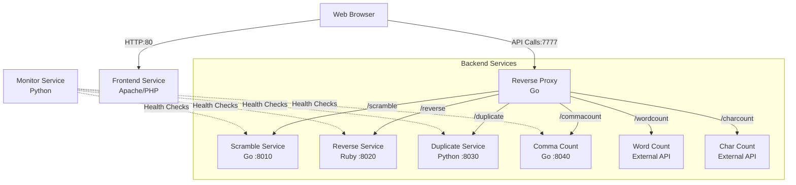

# Docker Text Editor

This project is a text editor built with microservices. It demonstrates distributed systems and container orchestration.

## Overview

The application is a web tool for editing text. We call it QUBeditotron.

It breaks features into separate services instead of using one large program. This allows us to use the best language for each task.

**Features**

*   **Text Tools** Scramble, reverse, duplicate, and analyze text.
*   **Multiple Languages** We use Go, Python, Ruby, and JavaScript.
*   **Reverse Proxy** A Go service routes traffic to the backend.
*   **Monitoring** A Python script checks if services are running.
*   **Containers** Every component runs in its own Docker container.

## Architecture

The frontend sends requests to a reverse proxy. The proxy routes them to the correct backend service.



## Services

| Service | Language | Port | Description |
|---------|----------|------|-------------|
| **Frontend** | HTML/JS/PHP | 80 | The user interface. |
| **Reverse Proxy** | Go | 7777 | Routes API requests. |
| **Scramble** | Go | 8010 | Randomises text. |
| **Reverse** | Ruby | 8020 | Reverses text. |
| **Duplicate** | Python | 8030 | Counts duplicate words. |
| **Comma Count** | Go | 8040 | Counts commas. |
| **Monitor** | Python | N/A | Checks service health. |

## Getting Started (Locally)

You need Docker and Git installed.

### Run the Services

Each service has its own container. Follow these steps to build and run them.

#### 1. Network

Create a network so the containers can talk to each other.

```bash
docker network create editor-net
```

#### 2. Backend Services

**Scramble (Go)**

```bash
cd Services/editor-scramble
docker build -t editor-scramble .
docker run -d -p 8010:8010 --name editor-scramble editor-scramble
```

**Reverse (Ruby)**

```bash
cd Services/editor-reverse
docker build -t editor-reverse .
docker run -d -p 8020:8020 --name editor-reverse editor-reverse
```

**Duplicate (Python)**

```bash
cd Services/editor-duplicate
docker build -t editor-duplicate .
docker run -d -p 8030:8030 --name editor-duplicate editor-duplicate
```

**Comma Count (Go)**

```bash
cd Services/editor-commacount
docker build -t editor-commacount .
docker run -d -p 8040:8040 --name editor-commacount editor-commacount
```

#### 3. Infrastructure

**Reverse Proxy (Go)**

```bash
cd Services/reverse-proxy-editor
docker build -t reverse-proxy .
docker run -d -p 7777:7777 --name reverse-proxy --link editor-scramble --link editor-reverse --link editor-duplicate --link editor-commacount reverse-proxy
```

*Note: If you use a custom network use `--network editor-net` instead of `--link`.*

**Frontend**

```bash
cd ../.. # Back to root
docker build -t editor-frontend .
docker run -d -p 80:80 --name editor-frontend editor-frontend
```

**Monitor**

```bash
cd Services/monitor-editor
docker build -t monitor-editor .
docker run -d --name monitor-editor monitor-editor
```

## Usage

1.  Open `http://localhost`.
2.  Type text in the box.
3.  Click the buttons to change the text.
    *   **Word/Char Count** Checks external APIs.
    *   **Scramble** Mixes up the words.
    *   **Reverse** Flips the text.
    *   **Duplicate** Checks for duplicate words.
    *   **Comma Count** Counts the commas.
4.  **Save/Load** Enter a code to save your text locally.
